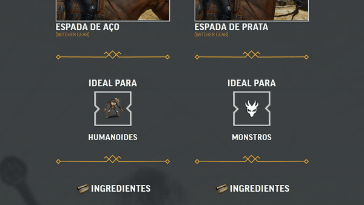
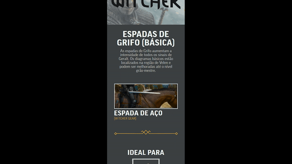

# Receita Wither 3 - Espadas de Grifo - Steel and Silver
### Página informativa mostrando localização do grimório para forja das duas espadas de Grifo básicas do game The Witcher 3


[](https://benssssss.github.io/8-witcher-sword-recipe-project/)


[](https://github.com/benssssss/8-witcher-sword-recipe-project)


---

# Processo

## Design
### Design e layout feito usando pacote Adobe 

1 - Obter referência e layout

2 - Escolher tema e obter assets

3 - Escolher cores

## Planejamento

1 - Fazer desenho de caixas (grid-flex) antes de escrever qualquer código, definindo quais elementos serão usados (desenho no pdf abaixo)

### Aqui há um pdf com todos os assets, design, planejamento e referência de layout

([Design-receita-witcher3-assets](https://drive.google.com/file/d/12rbfeaBVIdIjNieM98v0ioz2KlD6WhAn/view?usp=sharing))

---

## Código
### Inicio em (mobile first) 350px 


### Implementações

- Usei varios arquivos .css para diferentes partes da página, assim deixando o código mais organizado

---

- Usei um arquivo global.css para escrever códigos que são usados varias vezes no projeto, assim quando necessario era só adicionar uma classe no html, ao inves de escrever todo o código novamente no css, diminuindo a quantia de linhas e confusão

---

- Usei um arquivo de variables.css para cores, tamanhos de fonte e medidas especificas como width: 100% e paddings para mobile

---

- Usei um arquivo separado para fazer um container para a parte do quadro, assim facilitando o uso, apenas alterando a foto interna no .html


---

## Responsivo

- Fiz 3 sections no código

### 1 - Header e titulo


---

### 2 - Espada de aço

### 3 - Espada de prata

---

- A espada de aço e prata estavam dentro de uma div (.responsive) usada como container para os dois, com um display: flex; column para uma seção ficar embaixo da outra, (uma seção com todas as informações da espada de aço e outra seção embaixo com todas as informações da espada de prata)

```
.responsive {
    display: flex;
    flex-direction: column;
}
```


- Alterei a direção do flex-direction e defini uma largura fixa para cada seção (45%), para que as duas seções ficassem uma do lado do outro sem estourar as informações para fora da tela

```
@media(min-width: 768px){
    .section {
        width: 45%;
    }

    .responsive {
        flex-direction: row;
    }
}

```

---

# Erros e aprendizados

## 1 - A duas seções ficaram desalinhadas na vertical

 

### Consertei usando 

```
@media(min-width: 768px){
    .responsive {
        align-items: baseline;
    }
}

```


---

## 2 - A seções ficaram muito juntas, uma encostada na outra, e sobrando espaço nos extremos


### Consertei usando 

```
@media(min-width: 768px){
    .responsive {
        justify-content: space-evenly;
    }
}

```


---

## 3 - Arrabescos ficaram sobrando na parte inferior

- Para a divisão das duas seções usei um arrabesco prata na ligação entre as duas seções


- Porem quando o responsivo é ativado elas ficam sobrando no final da página


- Para remover elas no (+768px) coloquei uma classe individual (transition-between) nas duas e usei os mesmos atributos dos outros arabescos da página, então quando +768px inseri um display: none;

```
@media(min-width: 768px){
    .transition-between {
        display: none;
    }
}

```


---

# Tecnologias utilizadas
- HTML5 Markup 
- CSS
- Clean Code
- Photoshop
- Illustrator

# Autor
### Jefferson Augusto (a.k.a Benssssss) 
## [LinkedIn](https://www.linkedin.com/in/benssssss/)

## Projeto n.º8
